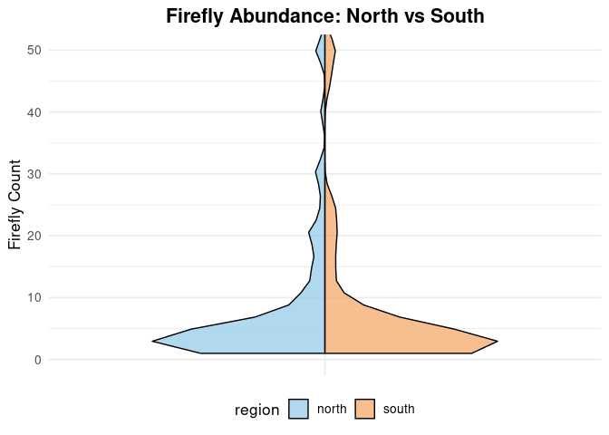

Firefly Mini-Report
================
Sara Deschaine
2025-11-27

- [Abstract](#abstract)
- [Background](#background)
- [Study Question and Hypothesis](#study-question-and-hypothesis)
  - [Question](#question)
  - [Hypothesis](#hypothesis)
  - [Prediction](#prediction)
- [Methods](#methods)
  - [Violin Plot](#violin-plot)
  - [Sharpiro-Wilk test](#sharpiro-wilk-test)
- [Discussion](#discussion)
  - [Intrepetation of Plot](#intrepetation-of-plot)
  - [Intrepetation of Sharpiro-Wilk
    test](#intrepetation-of-sharpiro-wilk-test)
- [Conclusion](#conclusion)
- [References](#references)

# Abstract

Fireflies are important insects that help with pollination and serve as
food for other animals. This study looked at whether firefly numbers are
higher in northern or southern Utah. Using citizen science data, we
compared firefly counts between regions with graphs and a statistical
model. Contrary to our expectations, southern Utah had more fireflies
than the north, with counts about three times higher. While there was a
lot of variation, the difference was statistically significant. These
results suggest that local habitat, vegetation, or other environmental
factors may influence firefly populations more than temperature or
moisture alone. Understanding where fireflies thrive can help guide
conservation efforts and protect these unique insects.

# Background

Fireflies are an ecologically important group of insects because they
contribute to pollination, are a natural pest control agent, and are a
food source for other animals. Understanding more about fireflies,
including where they are most abundant in local areas, provides insight
into habitat quality and guides conservation efforts. In our study we
hypothesize that northern counties in Utah will have a higher abundance
in fireflies compared to south. Fireflies are bioluminescent beetles
that use light signals for mating and communication, this makes them
sensitive to environmental changes that affect light or habitat
conditions (Evans et al., 2018). “Most fireflies need moisture to
complete their life cycle, preventing desiccation of vulnerable immature
stages and ensuring availability of their soft-bodied invertebrate prey.
Because of their reliance on moisture, fireflies are typically found
near permanent water sources.”(Lewis et al., 2024). Northern Utah
generally has cooler, wetter habitats, while southern Utah is hotter and
drier. This supports the idea that northern regions may provide better
habitat conditions for fireflies. By examining regional differences in
firefly abundance, this study helps reveal how climate and habitat
conditions influence local insect populations.

# Study Question and Hypothesis

## Question

Do northern counties in Utah have a higher abundance of fireflies
compared to southern counties?

## Hypothesis

We hypothesize that northern counties in Utah will have a higher
abundance of fireflies compared to southern counties, potentially due to
differences in environmental conditions such as temperature, moisture,
and habitat availability that are more favorable in the north.

## Prediction

If geographic location affects firefly abundance, then northern counties
in Utah will have a noticeably greater number of fireflies than southern
counties, reflecting regional differences in suitable habitat and
environmental conditions.

# Methods

We obtained data from Fireflies Citizen Science in Logan, which compiles
local firefly observation records. From this dataset, we extracted the
relevant information on firefly abundance and county locations in Utah,
which we then categorized into northern and southern regions. We drew a
line from Juab County to Carbon County, defining everything north of the
line as Northern Utah and everything south of it as Southern Utah. Using
RStudio Cloud, we created two visualizations, a box plot and a violin
plot which compared firefly abundance between the north and south.
Finally, we conducted a t-test to determine whether the observed
differences were statistically significant.

## Violin Plot

We also made a split violin plot to compare firefly counts in the north
and south. The plot shows the distribution of counts on each side, with
colors for each region and the y-axis capped at 50 to keep it readable.

``` r
# Split Violin Plot (y-axis limited to 50)

library(ggplot2)
library(gghalves)
library(stringi)

# Read and clean your data
fireflies <- read.csv("Copy of firefliesUtah - Usable Data.csv", stringsAsFactors = FALSE)
colnames(fireflies) <- c("firefly_count", "region")

fireflies$region[fireflies$region == ""] <- NA
fireflies$region <- stri_trans_general(fireflies$region, "NFKC")
fireflies$region <- stri_replace_all_regex(fireflies$region, "\\p{C}", "")
fireflies$region <- gsub("\u00A0", " ", fireflies$region)
fireflies$region <- trimws(tolower(fireflies$region))
fireflies$region[fireflies$region %in% c("n", "nrth", "noth")] <- "north"
fireflies$region[fireflies$region %in% c("s", "sth", "soth")] <- "south"
fireflies$region <- factor(fireflies$region, levels = c("north", "south"))
fireflies_clean <- droplevels(subset(fireflies, !is.na(region)))

# Split violin plot
ggplot() +
  geom_half_violin(
    data = subset(fireflies_clean, region == "north"),
    aes(x = factor(1), y = firefly_count, fill = region),
    side = "l", trim = TRUE, color = "black", alpha = 0.7
  ) +
  geom_half_violin(
    data = subset(fireflies_clean, region == "south"),
    aes(x = factor(1), y = firefly_count, fill = region),
    side = "r", trim = TRUE, color = "black", alpha = 0.7
  ) +
  scale_fill_manual(values = c("north" = "#8EC9E8", "south" = "#F4A261")) +
  coord_cartesian(ylim = c(0, 50)) +   # y-axis capped at 50
  labs(
    title = "Firefly Abundance: North vs South",
    x = NULL,
    y = "Firefly Count"
  ) +
  theme_minimal(base_size = 13) +
  theme(
    legend.position = "bottom",
    plot.title = element_text(size = 16, face = "bold", hjust = 0.5),
    axis.text.x = element_blank(),
    axis.ticks.x = element_blank()
  )
```

    ## Warning: Removed 1 row containing non-finite outside the scale range
    ## (`stat_half_ydensity()`).

<!-- -->

## Sharpiro-Wilk test

FIX THIS.

``` r
# Shapiro–Wilk tests for normality

shapiro.test(
fireflies$firefly_count[fireflies$region == "south"]
)
```

    ## 
    ##  Shapiro-Wilk normality test
    ## 
    ## data:  fireflies$firefly_count[fireflies$region == "south"]
    ## W = 0.22918, p-value = 3.044e-16

``` r
##
## Shapiro-Wilk normality test
##
## data: fireflies$firefly_count[fireflies$region == "south"]
## W = 0.19196, p-value < 2.2e-16
shapiro.test(
fireflies$firefly_count[fireflies$region == "north"]
)
```

    ## 
    ##  Shapiro-Wilk normality test
    ## 
    ## data:  fireflies$firefly_count[fireflies$region == "north"]
    ## W = 0.17659, p-value < 2.2e-16

``` r
wilcox.test(firefly_count ~ region, data = fireflies,
alternative = "greater")
```

    ## 
    ##  Wilcoxon rank sum test with continuity correction
    ## 
    ## data:  firefly_count by region
    ## W = 13812, p-value = 0.2794
    ## alternative hypothesis: true location shift is greater than 0

``` r
tapply(fireflies$firefly_count, fireflies$region, median)
```

    ## north south 
    ##    NA     4

# Discussion

## Intrepetation of Plot

FIX THIS

## Intrepetation of Sharpiro-Wilk test

FIX THIS

# Conclusion

FIX THIS

# References

1.  ChatGPT. OpenAI, version Jan 2025. Used as a reference for functions
    such as plot() and to correct syntax errors. Accessed 2025-11-27

2.  Evans, T. R., Salvatore, D., van de Pol, M., & Musters, C. J. M.
    (2018). Adult firefly abundance is linked to weather during the
    larval stage in the previous year. Ecological Entomology, 44(2),
    265–273. <https://doi.org/10.1111/een.12702>

3.  Lewis, S. M., Jusoh, W. F. A., Walker, A. C., Fallon, C. E., Joyce,
    R., & Yiu, V. (2024). Illuminating Firefly Diversity: Trends,
    Threats and Conservation Strategies. Insects, 15(1), 71.
    <https://doi.org/10.3390/insects15010071>
